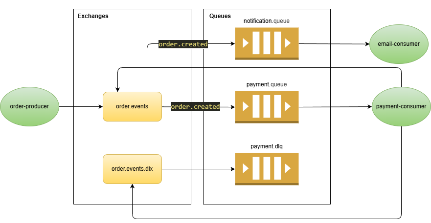

# Mensageria Lab

Laboratorio de mensageria em Java com Maven e RabbitMQ, agora organizado em servicos Spring Boot independentes:

- `order-producer`: API HTTP que recebe pedidos e publica eventos.
- `payment-consumer`: consome pedidos, simula falha, aplica retry e envia para DLQ.
- `notification-consumer`: consome o evento de pagamento processado para notificacao.
- `dashboard`: reservado para uma interface visual futura.

As classes antes centralizadas em `shared` foram internalizadas em cada servico para remover o acoplamento entre modulos.

## Fluxo da aplicacao



## Subir o RabbitMQ

```bash
docker compose up -d
```

Painel do RabbitMQ:

- URL: `http://localhost:15672`
- Usuario: `guest`
- Senha: `guest`

## Compilar

Na raiz, o agregador continua opcional para empacotar todos os servicos de uma vez:

```bash
mvn clean package -DskipTests
```

Ou compile cada servico isoladamente:

```bash
cd order-producer && mvn clean package -DskipTests
cd payment-consumer && mvn clean package -DskipTests
cd notification-consumer && mvn clean package -DskipTests
```

## Executar os modulos

Cada servico pode subir sozinho, sem `-am` e sem dependencia de outro modulo Maven:

```bash
cd order-producer && mvn spring-boot:run
cd payment-consumer && mvn spring-boot:run
cd notification-consumer && mvn spring-boot:run
```

## Criar um pedido

```bash
curl -X POST http://localhost:8080/orders ^
  -H "Content-Type: application/json" ^
  -d "{\"customerId\":\"cliente-1\",\"amount\":150.00,\"simulatePaymentFailure\":false}"
```

Para testar retry + DLQ, envie `simulatePaymentFailure=true`.
